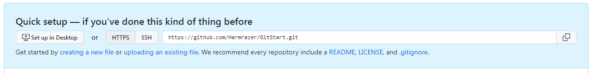
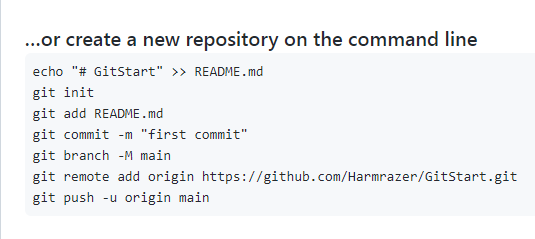
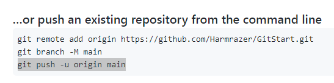

# Начало работы с Git

## Введение
***Система контроля версий — это система, записывающая изменения в файл или набор файлов в течение времени и позволяющая вернуться позже к определённой версии.***

### **С чего начать?** 
1. ***Установка необходимого софта***

 Для начала необходимо установить сам Git используя установщик с зависимости от операционной системы 
  
https://git-scm.com/downloads  -ссылка на git
https://code.visualstudio.com/ - ссылка на VS Code

2. ***Информация по использованию текстового редактора кода***

Далее необходимо установить VS Code для удобства работы с git в терминале или испозовать встроенный терминал в MacOs или git bash в Windows.

3. ***Регистрация в git***

Для начала работы необходимо зарегистрироваться в git, а для этого необходимо следующее:
    
В Windows нужно запустить git bash и ввести следующие строчки:
* git config --global user.name "Ваше имя, ник, название компьютера или иное"
* git config --global user.email ваша_почта@example.com

4. ***Создание папки для хранения репозитория***
Создаем папку для репозитория git. Запомните путь к созданной папке.
5. ***Запуск и работа в git***

* Запускаем VS Code
* Открываем вкладку терминал и создаем новый
* **важно!!!** в меню выбираем открыть папку в проводнике выбираем путь к папке, которую с создали для репозитория
* вводим в терминале команду git init и жмем enter
* далее создаем новый вайл и называем его по своему усмотрению и в конце указываем необходимое расширение, в зависимости от того, какой редактор вы используете (.txt, .md и тд)
* Видим справа от файка буква "U", это значит, что файл не отслеживается, тогда вводим команду git add и вручную или с помощью кнопки tab выбираем созданный файл и вводим команду кнопкой enter в терминале: git add example.md 
* далее для сохранения изменений вводим команду: git commit -m "пометка", где -m дает возможность написать заметку в ковычках для удобства навигации в истории изменений. 
**Важно!!!** Без сохранения команда commit не сработает.
* Теперь у вас есть Git-репозиторий с отслеживаемым файлом и начальным коммитом.

6. **Дополнительные команды**

* ***Использование команды get log***

Команда **git log** показывает историю коммитов с их уникальными идентификаторами состоящими из букв и цифр (06535905f22f3aee268f13987f320af0634c8a86) и какой коммит сейчас используется, он с пометной master (HEAD -> master)
* ***Команда git status***

Отображает текущий статус отслеживаемого файла

* ***Команда git checkout***

Если у вас несколько сохранений и вам нужно переключиться на другую версию, это можно сделать с помощью команды git checkout. Для этого нужно указать первые 4 символа уникального идентификатора нужного коммита: git checkout 0653 и откроется та версия которой соответствует данный индентификатор.

* ***Команда git help***

Показывает команты git

* ***Команда git diff*** 

Показывает различия между файлами, если файлов несколько 

7. **Ветвление в git**
Используя ветвление, Вы отклоняетесь от основной линии разработки и продолжаете работу независимо от неё, не вмешиваясь в основную линию.

* ***Просмотр всех имеющихся веток***

Чтобы посмотреть все имеющиеся ветки нужно ввести команду __*git branch*__.

* ***Создание новой ветки***

Чтобы создать новую ветку необходимо ввести команду __*git branch new_branch*__ , где new_branch название новой ветки.

* ***Переключение между ветками***

Чтобы переключиться на нужну ветку необходимо ввести команду __*git checkout name_branch*__, где name_branch название необходимой ветки.

* ***Слияние веток***

Если при работе на отдельных ветках Вы решили обединить данные обеих веток, то можно произвести их слияние, для этого нужно перейти на ту ветку в которую нужно перенести данные из другой ветки и выполнить команду __*git merge name_of_the_branch_being_merged*__, где name_of_the_branch_being_merged имя добавляемой ветки.

* ***Удаление ветки***

Для удаления ненужной ветки необходимо ввести команду __*git branch -d name_of_the_branch_being_deleted*__, где name_of_the_branch_being_deleted имя удаляемой ветки.

8. **Добавление картинок**

Чтобы добавить картинку необходимо добавить нужную картинку в корень репозитория, затем ввести команду:  ! [ Message] (picture_name.jpg), где в [] можно написать сообщение, а в() указывавется название картинки с расширением

9. **Игнорируемые git-ом файлы**

В git есть функция, которая позволяет игнорировать незакоммиченные файлы. Чтобы она работала необходимо создать новый файл с именем .gitignore, сохранить его и закоммитить и добавить в него список имен файлов с расширением, которые git будет игнорировать в дальнейшем.

Игнорируемые файлы будут помечены серым.

10. **Конфликты**

При слиянии веток могут возникать конфликты. Конфликты эти связаны с несовпадением данных в сливаемых ветках, которые не могут быть решены простым дополнением одной ветки другой.
Решить этот конфликт git предлагает 4-мя способами:

* __Accept Curent Change__ - оставить текущую версию не применяя  конфликтную информацию со объединяемой ветки 
* __Accept Incoming Change__ - заменить текущиую конфликтную информацию на изменения объединяемой ветки 
* __Accept Both Changes__ - объединить изменения с двух веток
* __Compare Changes__ сравнить в объединяемых ветках различия, которые приводят к конфликту

  
11. **Подробное отображение коммитов используя _--graph_**

Чтобы более подровно отобразить историю коммитов с учетом веток нужно ввести команду git log --graph

## Удаленные репозитории и работа с GitHub

**Github** предоставляет возможности не только по просмотру кода и его распространения, но также историю версий, инструменты совместной разработки, средства для предоставления документации, выпуска релизов и обратной связи. И самое интересное, что вы можете размещать на Gihub как открытые, так и приватные проекты. 

1. **Клонирование репозитория git clone.** Для начала работы с GitHub давайте зайдем на сайт github.com и склонируем репозиторий с него. для этого нам нужно знать адрес ссылки или просто воспользоваться поиском и найти нужный проект.

Для примера воспользуемся проектом Ильнара Шафигуллина, щедро предоставившего нам свой проет общем доступе как public. Жмем зеленую кнопку "Code" и копируем ссылку

Затем заходим в Visual Studio Code, преварительно подготовив папку для клонирования репозитория и вводим следующую команду:
**git clone https://github.com/ilnar-geekbrains/version_control_lection_3.git** - где в конкретном случае ссылка на репозиторий Ильнара Шафигуллина, но может быть и другая. Репозиторий склонирован.

2. **Отправка репозитория в GitHub.** Чтобы отправить свой локальный репозиторий в GitHub нужно сначала создать репозиторий на GitHub, чтобы получить ссылку доступа. **Важно!** для этого нужно иметь аккаунт на GitHub. 
После создания репозитория GitHub сам подскажет дальнейшие действавия:

Покажет ссылку на ваш репозиторий:

Покажет как настроить новый репозиторий:

И как отправить локальный репозиторий в GitHub:

3. **Вытягивание репозитория из GitHub.** 
GitHub позволяет как "заливать" актуальную версию репозитория с локального компьютера, так и "вытаскивать" обновленные версии репозитоия из GitHub. Для этого нужно открыть соответствующий репозиторий на локальном компьютере в VS code и выполнить команду git pull. Так же GitHub позвооляет редактировать репозиторий внутри себя и коммитить его, что дает несомненно большие возможности для работы в программировании.

4. **Fork в GitHub**

Fork дает возвожность создать копию любого проекта и вносить свои изменения в него для дальнейшего улучшения. При этом оригинальная версия проекта не будет изменена. Чтобы изменения принялись, нужно отправить реквест со своими дополнениями и изменениями владельцу проекта чтобы он их одобрил. 

Чтобы копировать проект нужно нажать на GitHub кнопку **Fork** в правом верхнем углу.
